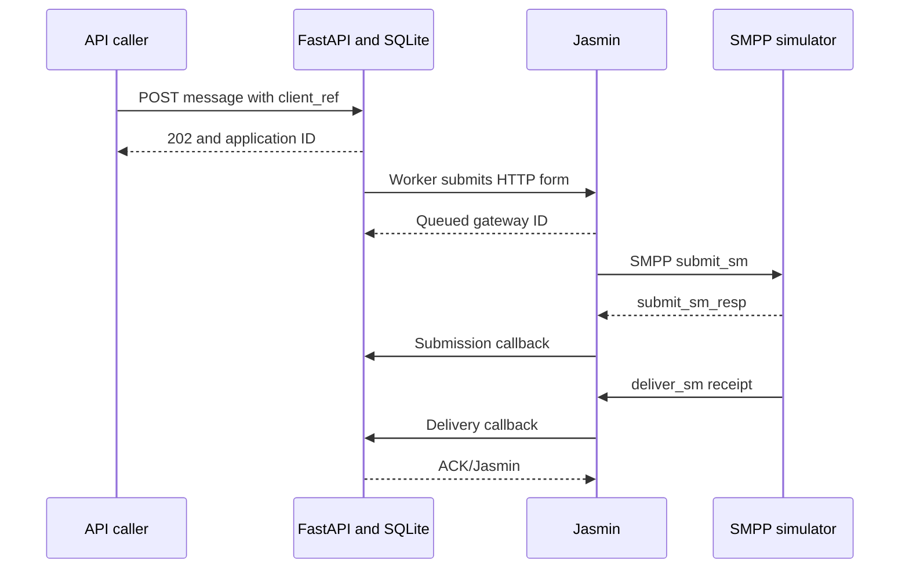

# Jasmin SMS Gateway demo

A developer lab using **real Jasmin**, a **simulated SMPP provider**, and a
**FastAPI application** with a persistent SQLite outbox and delivery history.
The interactive interface is FastAPI's Swagger UI. There is no separate frontend.

**No real SMS is sent. No provider account, SIM card, or paid SMS credit is needed.**
All destinations in this lab are treated as simulation inputs; they are not
claims about whether those numbers exist in the real world.

## Start the demo

Requirements: Docker Engine with the Docker Compose v2 plugin, or Docker Desktop
running Linux containers on Windows. The first build needs internet access to
download images and Python packages. An ordinary laptop with about 2 GB of spare
RAM is a reasonable starting point, not a measured production sizing claim.

Extract the ZIP, open a terminal inside its `jasmin-demo` folder, and run:

```bash
docker compose up --build -d
docker compose logs bootstrap
docker compose ps -a
```

Bootstrap should report `Simulator is BOUND_TRX`. The bootstrap container then
exits successfully; that is expected. The other five services stay running.

Open **http://localhost:8000/docs** in your browser.

1. Click **Authorize** and enter `local-demo-key` for `X-API-Key`.
2. Expand **POST /messages**, click **Try it out**, and use:

```json
{
  "client_ref": "my-first-sms",
  "to": "256700000001",
  "content": "Hello from my Jasmin demo!"
}
```

3. Execute. Copy the returned application `id`.
4. Open **GET /messages/{message_id}**, enter that ID, and execute.
5. Within a few seconds, expect `DELIVERED`, a Jasmin `gateway_id`, and saved
   receipt `events`. Refresh the GET request to see changes; Swagger does not poll.

Use **GET /messages** to list the latest 50 messages. Reusing `client_ref` with
identical data returns the same message and does not submit a second SMS.
Use a new reference for another experiment. Reusing a reference with different
data returns HTTP 409.

Swagger UI loads its JavaScript from a public CDN in your browser. If that CDN
is unavailable, use curl, PowerShell, or the smoke-test script instead.

## Four experiments

| Destination | Simulated provider behavior | Expected application status |
|---|---|---|
| `256700000001` | Accept, then send a successful delivery receipt | `DELIVERED` |
| `256700000002` | Accept, then send a failed delivery receipt | `UNDELIVERABLE` |
| `256700000003` | Reject the SMPP submission | `REJECTED` |
| `256700000004` | Accept, but never send a final delivery receipt | `ACCEPTED` |

The fourth case deliberately remains unresolved. This demo does not invent a
delivery result when the provider supplies none. It does not include a timer to
expire old unresolved application records.

Only these destinations are accepted by both the application and simulator.
Content is limited to 160 characters from a basic text subset. Unicode,
multipart SMS, MO/incoming messages, campaigns, billing, and real carrier
integration are deliberately outside the first demo.

## Verify the full stack

After startup, run this from the project directory. Host Python is not required:

```bash
docker compose exec -T api python scripts/smoke_test.py
```

This submits three messages through the real Jasmin container, checks delivered,
undeliverable and rejected outcomes, verifies saved callbacks, and checks that
repeated requests reuse the original application ID.

To test provider downtime, use host Python 3.12 (or another Python 3 version):

```bash
python3 scripts/outage_test.py
```

On Windows, use `py scripts/outage_test.py`. The script stops **only this demo's
simulator**, submits a message while it is offline, restores the simulator, and
waits for delivery. It restarts the simulator even when an assertion fails.
Jasmin's lab connector uses short reconnect and requeue delays for this experiment.
If you override the demo API key, set the same `DEMO_API_KEY` in the host shell.

## What the code does



The application commits each message before its worker can send it. A worker
claims one pending row at a time. Jasmin authenticates the application's user,
selects the default route, and forwards traffic through its `simulator` connector.
RabbitMQ supports Jasmin's queueing, and Redis supports receipt correlation.

The callback URL contains the application ID and an HMAC token. This lets an
early callback correlate to the correct row even before the submission HTTP
response is recorded. Duplicate receipts are deduplicated; late acceptance
receipts cannot overwrite a terminal delivery state. Unexpected status strings
are retained as events without fabricating a final outcome.

Connection-establishment failures are retried up to three total attempts.
Read/write timeouts and unexpected responses become `UNKNOWN`, with no automatic
resend. An interrupted `SUBMITTING` row becomes `UNKNOWN` after a worker restart.
This reduces duplicate risk; it is not an exactly-once delivery guarantee.

Use one API process/worker with this lab. Do not add `--workers` or scale the API
service: the startup recovery policy assumes one worker. SQLite is used to keep
the demo small, not as a claim about the database you should use at scale.

## Project files

| File | Purpose |
|---|---|
| `compose.yaml` | Jasmin, RabbitMQ, Redis, simulator, bootstrap, and API |
| `app/main.py` | API authentication, validation, sender worker, callback endpoint |
| `app/store.py` | Persistent outbox, idempotency, delivery-state updates |
| `simulator/server.py` | Minimal SMPP provider implemented using `smpp.pdu3` |
| `scripts/bootstrap.py` | Configure the dedicated gateway through jCli |
| `scripts/configure_gateway.py` | Align INI credentials and bindings before Jasmin starts |
| `scripts/smoke_test.py` | Check three outcomes through the running full stack |
| `scripts/outage_test.py` | Stop/restart the simulator and check recovery |
| `tests/` | API, persistence, timeout, callback, and real TCP/SMPP tests |
| `VALIDATION.md` | What was and was not executed before delivery |

Read `app/main.py` first, then `app/store.py`, then `scripts/bootstrap.py`.
The `rate 0.0` route setting is a lab billing rate, not a throughput setting.
Connector throughput is configured separately as five messages per second.

## Logs, shutdown, and troubleshooting

```bash
docker compose logs --tail=100 bootstrap api simulator
docker compose logs --tail=100 jasmin
docker compose exec jasmin tail -n 60 /var/log/jasmin/default-simulator.log
docker compose down
```

`docker compose down` stops the lab but retains named volumes. A later `up`
reuses message history and Jasmin settings. Do not add `-v` unless you deliberately
want to erase **all this demo's saved configuration, queue data, and messages**.

If bootstrap fails, inspect its logs first. It requires a live jCli prompt,
valid lab credentials, and a simulator connection reaching `BOUND_TRX`. Run
`docker compose up -d` again after fixing the failure. Do not run the bootstrap
script against an existing production Jasmin installation.

If a message remains `QUEUED`, inspect the simulator and Jasmin logs. If it is
`ACCEPTED`, the provider acknowledged submission but a final receipt has not
arrived. The special `004` test intentionally behaves this way.

If `/docs` opens but the smoke test fails, the HTTP process is alive but the
message path is not verified. `/health` is intentionally a liveness check only.

Port 8000 is bound to the host's loopback interface. When running on an Ubuntu
server, access it through an SSH tunnel from your laptop:

```bash
ssh -L 8000:127.0.0.1:8000 ubuntu@YOUR_SERVER
```

Then open localhost on your laptop. Do not open port 8000 to the internet.

## Local development tests

With Python 3.12:

```bash
python3 -m venv .venv
. .venv/bin/activate
python -m pip install -r requirements-dev.txt
python -m pytest -q
```

On Windows PowerShell, activate with `.venv\Scripts\Activate.ps1`.
These tests do not require Docker or a provider account. Their mocked HTTP
gateway tests are component tests; they are not substitutes for the full-stack
smoke test above. The simulator tests do use actual local TCP connections.

## Boundaries and safety

This is a learning lab, **not production-ready client infrastructure**.

- Docker's `lab` network is internal and has no normal external egress. Only
  the API's loopback port is published. Real carrier access is not configured.
- Default credentials are intentionally obvious lab values. Optional overrides
  are listed in `.env.example`. Never reuse them in another system.
- The callback token is a local integrity check, not an upstream provider
  signature. Keep callback URLs and secrets out of logs.
- The app disables HTTP access logging to avoid logging callback tokens.
  Jasmin can still log message content. Use only invented, non-sensitive text.
- Persisted data is not encrypted and no backup, retention, or multi-user
  authorization policy is implemented.
- The SMPP simulator covers only the operations this demo needs. It cannot
  validate real handset delivery, carrier policies, sender registration,
  throughput contracts, Unicode billing, or carrier-specific receipt formats.
- Image tags follow the official Jasmin quickstart style and can change.
  After a successful run, record image digests and pin verified versions before
  using this as a repeatable team lab. Review and update dependencies before
  any exposure beyond localhost.
- RabbitMQ 3.13 and the pinned Python package versions are compatibility choices
  for this isolated lab, not current production security recommendations.

## Official references

- [Jasmin first SMS setup](https://docs.jasminsms.com/en/latest/installation/index.html#sending-your-first-sms)
- [Jasmin HTTP API and callback acknowledgement](https://docs.jasminsms.com/en/latest/apis/http/index.html)
- [jCli connector and routing configuration](https://docs.jasminsms.com/en/latest/management/jcli/modules.html)
- [Official Jasmin Docker definition](https://github.com/jookies/jasmin/blob/master/docker/Dockerfile)

This project is an independently authored educational integration. It is not an
official Jasmin distribution; dependencies retain their respective licenses.
